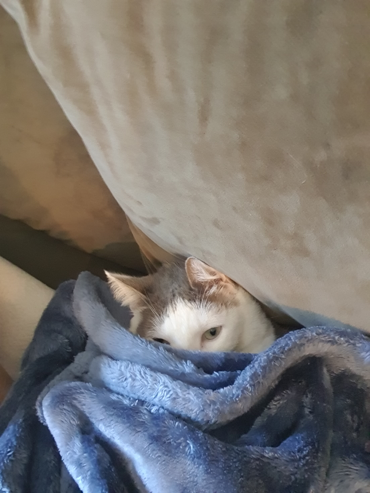

# Christopher's User Page

My name is Christopher Cha. I am a third year student at UCSD, and my main research interests are Natural Language Processing, Social Computing, and Recommender Systems.

## GOTO

[Media](#media-i-like-in-no-particular-order)

[Grad School](#grad-school-endeavors)

[Cat](#cat)

[Tasks](#tasks-left)

More personally, I like to watch movies and read manga. I've recently been rewatching a lot of [Wes Anderson](https://en.wikipedia.org/wiki/Wes_Anderson) and [David Lynch](https://en.wikipedia.org/wiki/David_Lynch) movies. If you have Netflix, I would recommend "What did Jack do?" because it's short. Other than that, I am a big proponent of a short experimental film called [Cat Soup (Nekojiru-So)](https://en.wikipedia.org/wiki/Cat_Soup), which released in 2001 and is probably as old as many of the people in our class.

In terms of my research, I do a lot in Python, but I'm also fond of Haskell (CSE 130 is a fun class) and APL. APL is especially interesting because you can do a lot of special characters and allows you to do weird stuff. Here are a few examples:

1. The arithmetic mean of a list of numbers:
    - `{(+⌿⍵)÷≢⍵}`
2. A list of prime numbers less than 20:
    - `{⍸2=+⌿0=∘.|⍨⍳⍵}20`
3. [Conway's Game of Life](https://aplwiki.com/wiki/Conway%27s_Game_of_Life):
    - `life ← {⊃1 ⍵ ∨.∧ 3 4 = +/ +⌿ ¯1 0 1 ∘.⊖ ¯1 0 1 ⌽¨ ⊂⍵}`

### Media I like in no particular order

- The Grand Budapest Hotel
- Serial Experiments Lain
- Star Trek TNG/DS9
- im thinking of ending things
- Annihilation
- The Witch
- Porco Rosso

### Grad School Endeavors

I've also been thinking about grad school a lot, but more of that thought has been focused on admissions. I think that it's frustrating that admissions always seem to be this black box without any certainty, even when I understand the reasoning behind it. When applying for my undergraduate, it seemed more like _"Apply everywhere and see where you can get in"_ rather than a _"You need to fulfil requirements **x**, **y**, and **z** to have a **XX**% chance of admission"_ like it had been in the past. 

Now for grad school, it seems like there's a similar feeling where chance takes a huge portion of all of it. Whether or not the professor has funding when you apply, if they see or miss your email, whether or not your research is aligned enough that they can give feedback and advice but different enough where you can pave your own research endeavors, etc. 

I remember a period last year where I asked a few professors about publications and their importance in admissions. One professor said
> Undergraduates rarely ever have the opportunity to publish, and it's usually enough to just have worked in a lab. Honestly, it's kind of suspicious when a student has publication because you don't know if they just straggled onto an established team and helped make diagrams.

While another said
> If you don't have papers published, your odds drop like a bowling ball.

Also I, along with some other people, applied to the CSE BS/MS program, and it has been the most frustrating and obfuscated thing ever. There are no released statistics, there's a minimum requirement that you have to be *somewhere* above that is loosely defined (GPA? Reseach experience?? Internships???), and the graduate advisors can't (or won't, not sure) give more details about any of it, just skirting away from the question. ;-;

### Cat
I also have a cat. 

She's pretty cute but also kind of fat so she's on a diet.

### Tasks left
- [x]  Picture
- [x]  Headings
- [x]  Styling text
- [x]  Quoting text
- [x]  Quoting code
- [x]  External Links
- [x]  Section links
- [x]  Relative links (Link to another .md file or an image in your repo. If linking to an image, encode it as a regular link rather than an image.)
- [x] Ordered and Unordered Lists
- [x] Task lists
